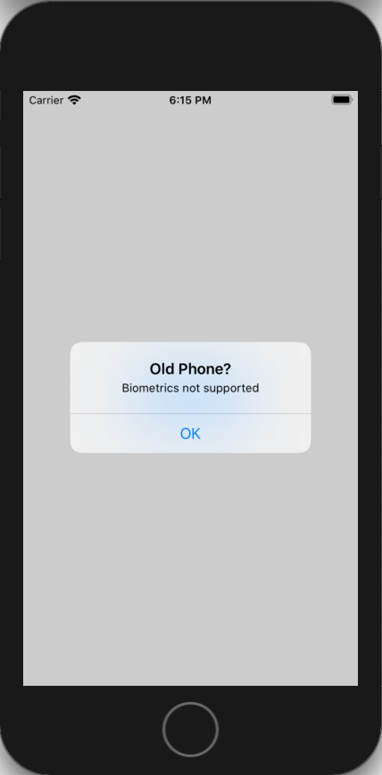
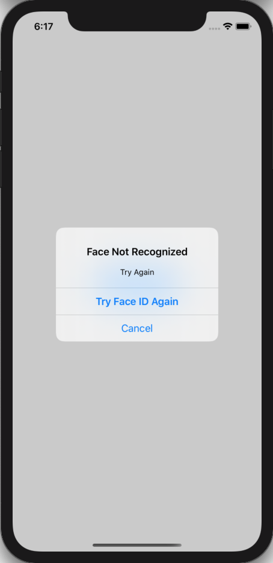
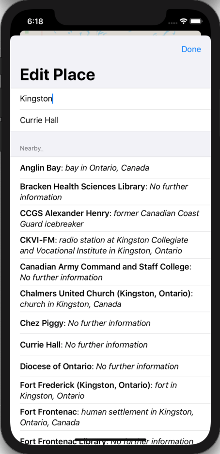
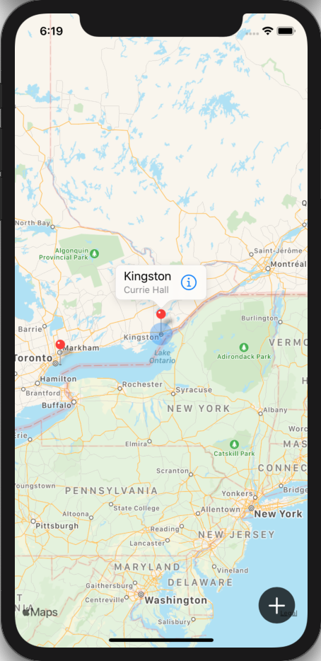

# 100 Days of SwiftUI Project 15

## BucketList

**App Description:**  App that presents a use with a map on which they can drop pins and save place names to visit.

**Swift Features Used:**
Using the Documents directory to save and retrieve data, integrating MapKit with SwiftUI using UIViewRepresentable, Biometric Authentication, secure Data writing, multiple alerts on one view, using URLSession to fetch nearby place names.

**Screenshots:**

